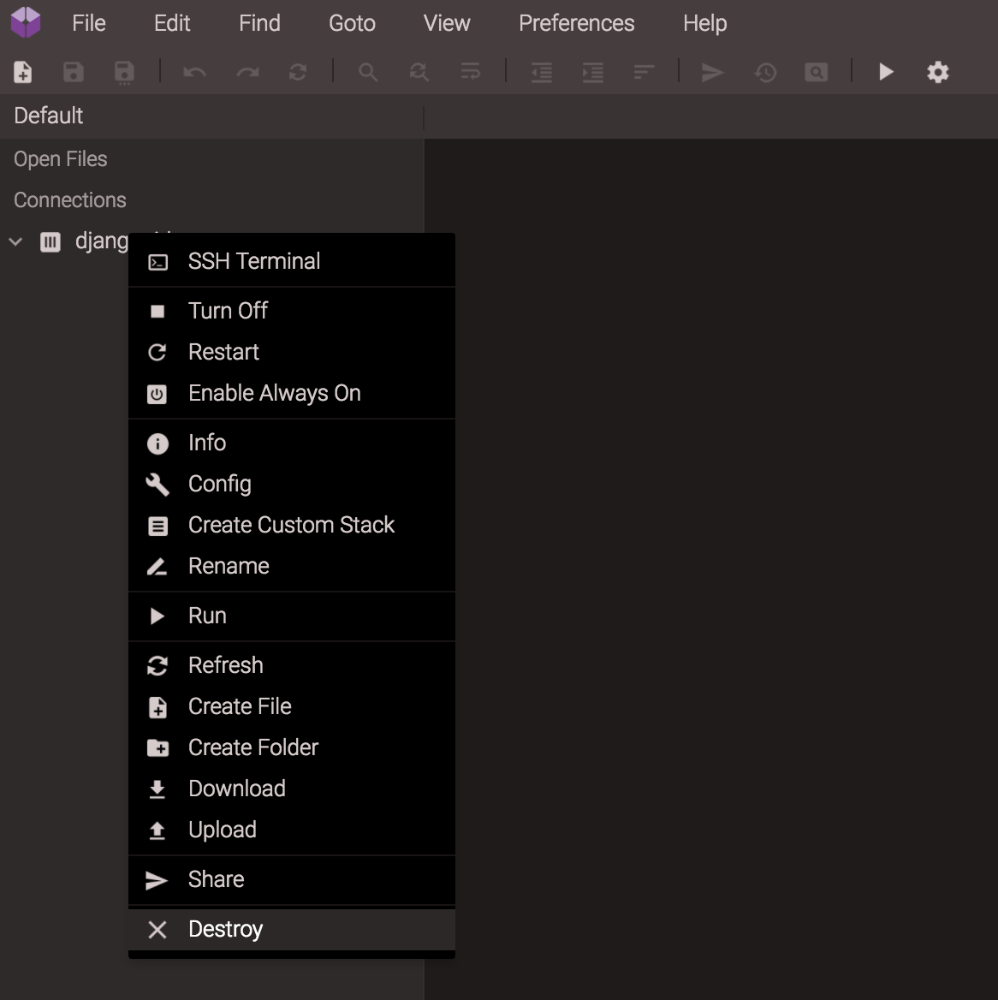
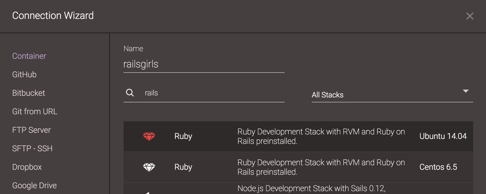

# Caso você já tenha usado codeanywhere

Provavelmente você já tem algum container criado. Como é uma conta de graça, podemos criar apenas 1 container por vez. Precisamos primeiramente deletar o container já existente.

# Criando o nosso container <3

Para fazer isso vamos no editor, clicando no botão **"Editor"**. Isso irá abrir o assistente de conexão _(Connection Wizard)_ - se isso não acontecer, você pode encontrá-lo em _File/New Connection/Container_.

Na janela do Connection Wizard, dê o nome "railsgirls" a seu projeto e use a caixa de busca (search stack) para pesquisar por *ruby*.

Para que tudo dê certinho, vamos nos certificar de escolher aquela que diz "Ruby" **e** "Ubuntu 14.04":

Após selecionar corretamente, clique em "Create" (você pode ter de usar a barra de rolagem para encontrar esse botão, que fica lá embaixo).
