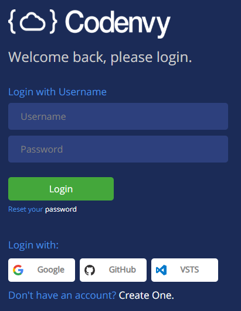

# Criando uma conta

O primeiro passo para utilizarmos o Codenvy é criar uma conta. Acesse o site e clique no link *"Create One"* para se registrar. Você pode usar seu e-mail ou uma conta: Google, GitHub ou VSTS.

# Valide seu e-mail

É necessário que você valide seu e-mail, então certifique-se de ter acesso a ele.

# Caso já tenha conta
Se loga aê e toca ficha :D
