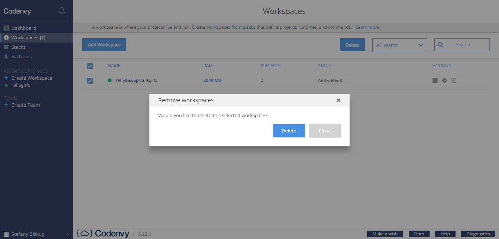
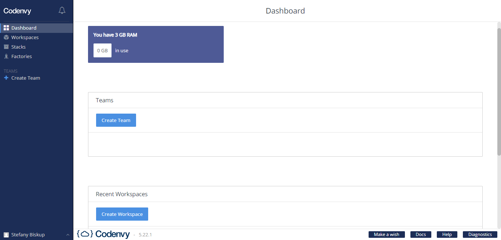
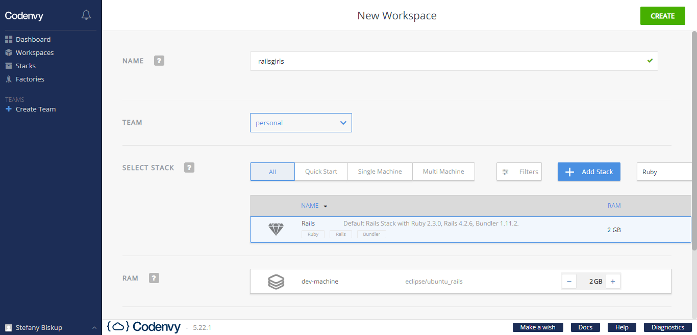

# Caso você já tenha usado o Codenvy

Provavelmente você já tem algum container criado. Como é uma conta de graça, podemos criar apenas um container por vez (por isso é mostrado o limite de 3 GB RAM). Primeiramente, precisamos excluir o container existente.
Siga para a seção *Workspaces*, no canto superior esquerdo, e selecione o container desejado. Após selecionar, clique em *Delete* e confirme a exclusão clicando em *Delete* novamente e aguarde até que uma mensagem de sucesso apareça na tela.

# Criando o nosso container <3

Para prosseguir, a partir do Dashboard (painel de controle em inglês), é necessário clicar no botão **"Create Workspace"**.

Isso irá abrir a janela de criação de uma nova área de trabalho. Nesta janela, dê o nome "railsgirls" ao seu projeto e use a caixa de busca para pesquisar por *Ruby* e selecionar a opção.
Para que tudo dê certinho, vamos nos certificar de escolher aquela que diz "Rails" e, na seção RAM, a opção "eclipse/ubuntu_rails":

Após selecionar corretamente, clique em *Create* e aguarde até que uma notificação de **Workspace is running** apareça na tela.
