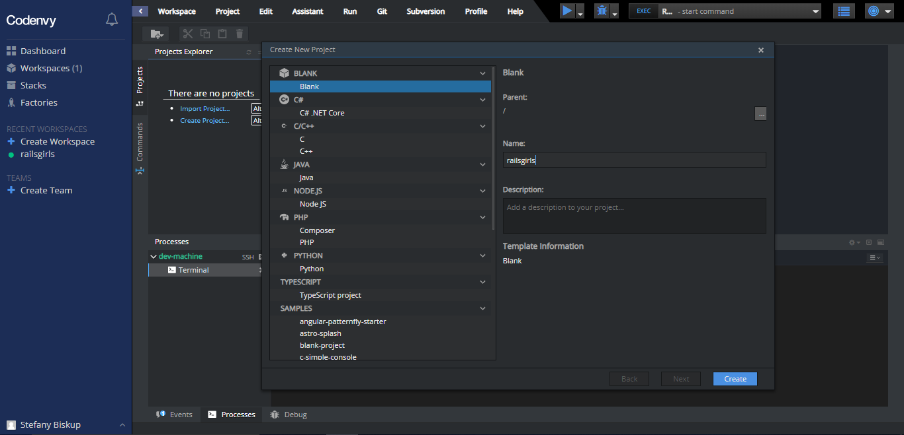

# Editor de código

Você está prestes a escrever sua primeira linha de código, então precisamos de um editor de código!

Existem muitos editores diferentes e em grande parte se resume a preferência pessoal. A maioria das pessoas que programam em Ruby usam as complexas, mas extremamente poderosas IDEs _(Integrated Development Environments, ou em português, Ambiente de desenvolvimento Integrado)_, tais como RubyMine.

Para o tutorial, usaremos o editor do Codenvy. Para isso, basta criar um novo projeto clicando no link *Create Project*. Vai abrir uma janela. Selecione a opção *Blank*, coloque o nome do projeto como "railsgirls" e clique em *Create*:

