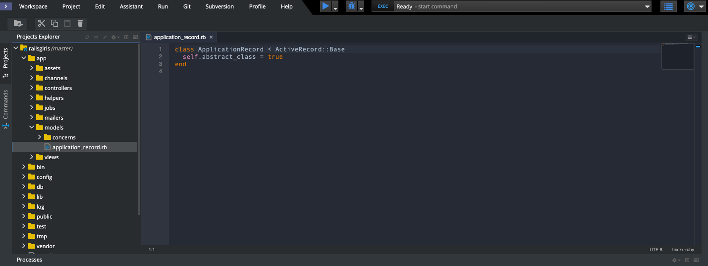
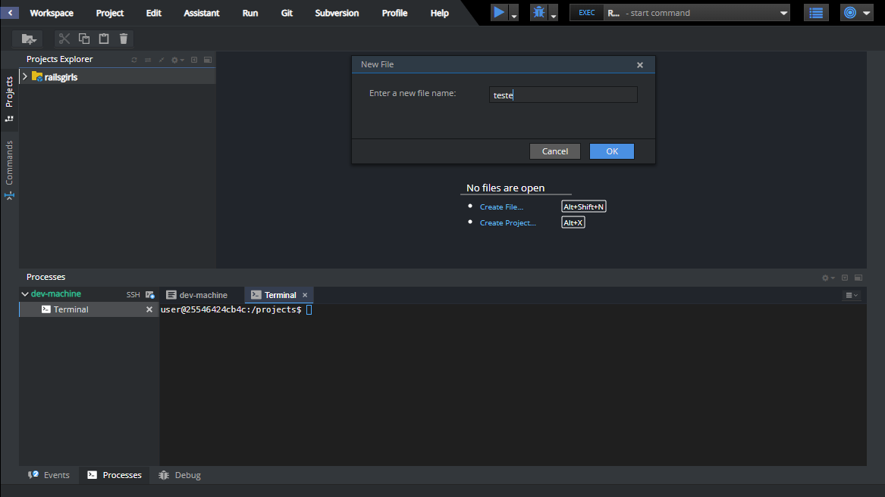

# Editor de código

Você está prestes a escrever sua primeira linha de código, então precisamos de um editor de código!

Existem muitos editores diferentes e em grande parte se resume a preferência pessoal. A maioria das pessoas que programam em Ruby usam as complexas, mas extremamente poderosas IDEs _(Integrated Development Environments, ou em português, Ambiente de desenvolvimento Integrado)_, tais como RubyMine.

Para o tutorial, usaremos o editor do Codenvy. Você verá que nós já temos o nosso projeto no canto esquerdo, onde mostra todos os arquivos dele. Não se assuste, apenas saiba que o projeto já foi criado :) 

A imagem abaixo mosta um arquivo qualquer do  nosso projeto sendo exibido dentro do editor do Codenvy, que é o que usaremos.

É possível criar arquivos também. Para isto, você precisa selecionar a pasta na qual quer criar o arquivo. Você terá que esperar um pouquinho para seu workspace carregar. Uma vez que ele estiver pronto, clique em *Create File*. Abrirá uma janela. Coloque o nome do arquivo e clique em OK:

