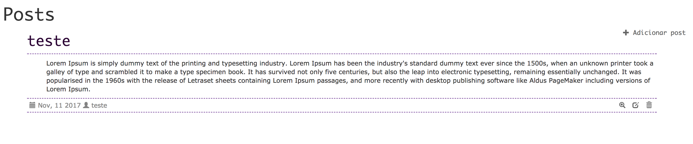
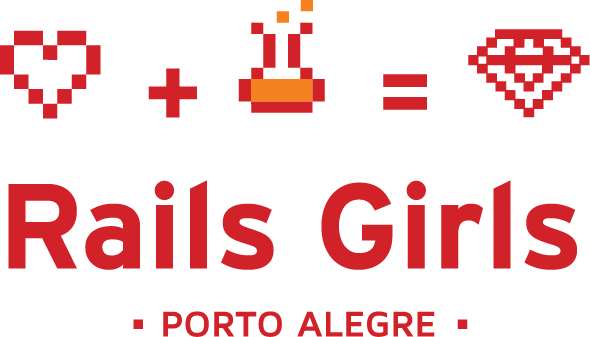

# O que você irá aprender durante o tutorial?

Quando você terminar o tutorial, terá uma aplicação web simples e funcional: seu próprio blog. Nós vamos mostrar como colocá-lo online para que outros vejam seu trabalho!
Ele se parecerá (mais ou menos) com isso:

Vamos lá!
