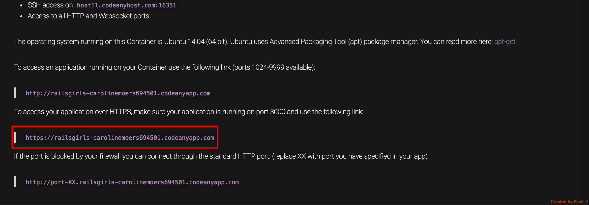
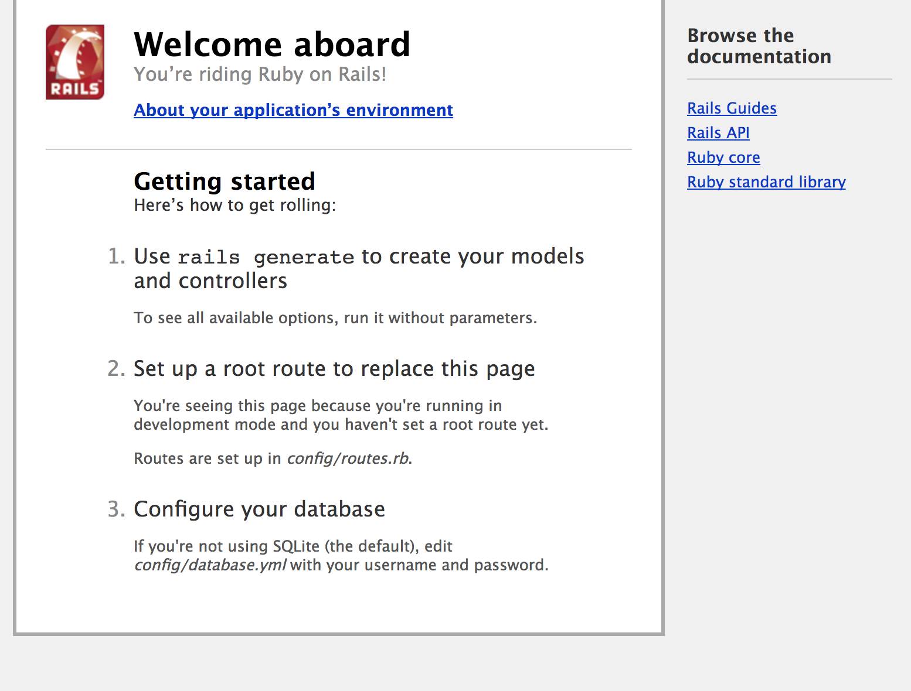

# Criando a aplicação

> Essa parte do tutorial é baseada no tutorial já criado para o evento: [http://www.maujor.com/railsgirlsguide/app.php](http://www.maujor.com/railsgirlsguide/app.php)

Então, vamos finalmente criar nosso blog?

Para isso vamos voltar ao terminal, lembra dele? Lá, vamos digitar o comando:

```sh
$ rails new railsgirls
```

Esse comando vai criar um projeto inteiro dentro de uma pasta chamada `railsgirls`, esse projeto já vai ter tudo o que precisamos para criar a nosso blog, você deve ter pastas mais ou menos assim:

```
railsgirls
├───app
├─── bin
├───config
├───db
├───lib
├───log
├───public
├───test
├───tmp
├───db
└───vendor
        .gitignore
        config.ru
        Gemfile
        Gemfile.lock
        Rakefile
        README.md

```

Vamos entrar na pasta que o rails criou:
```
$ cd railsgirls
```


No terminal, digite o comando:

```sh
$ rails server
```
Esse comando vai dizer para o Rails que queremos que nossa aplicação inicie, ou seja, assim como quando ligamos nosso computador e iniciamos um programa, queremos que o rails inicie um `servidor` (lembra quando falamos sobre como a internet funciona?) e nossa aplicação :)

Vamos ver o que o já temos?

No navegador, acesse a segunda URL que aparece nas informações do container do codeanywhere, deve ser algo parecido com isso:



Você deve estar vendo algo assim:



YAY! Já temos nossa aplicação rodando! Vamos começar a customizar?
