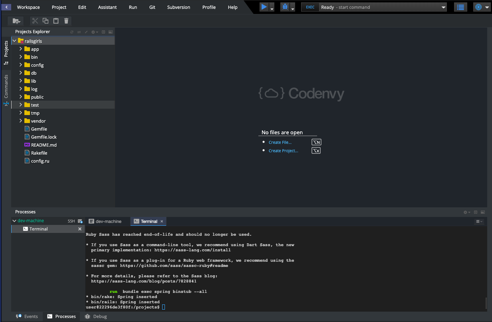
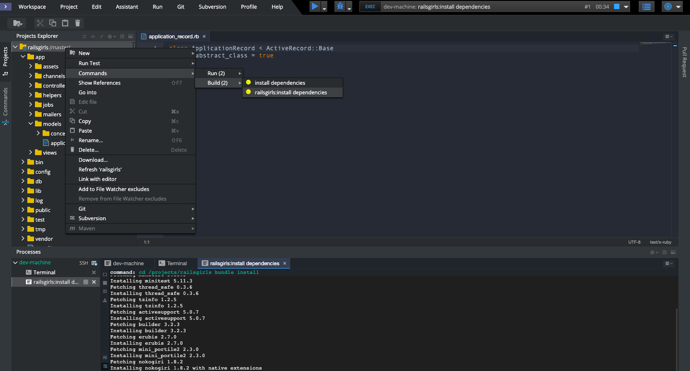
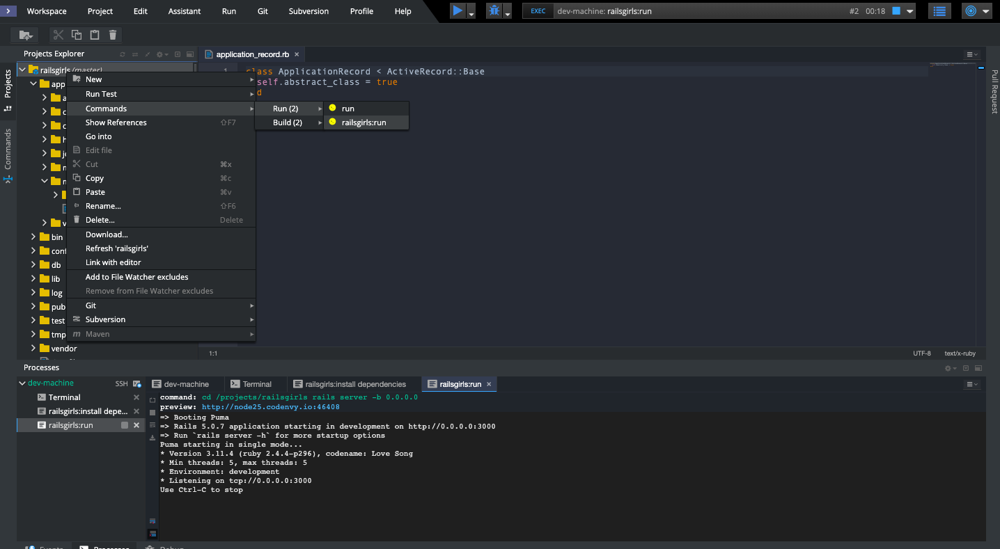
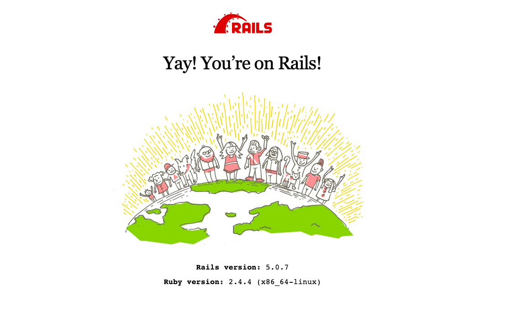

# Criando a aplicação

> Essa parte do tutorial é baseada no tutorial já criado para o evento: [http://www.maujor.com/railsgirlsguide/app.php](http://www.maujor.com/railsgirlsguide/app.php)

Então, vamos finalmente criar nosso blog?

Como já vimos, o nosso projeto Rails já está criado no Codenvy! Você deve ver arquivos e pastas criados como mostra a imagem. 

Primeiro, precisamos instalar todas as dependências necessária para que possamos executar este projeto. Para isso, vamos fazer uso das ferramentas do Codenvy.

Vamos selecionar a aba **Commands**, que fica ao lado esquerdo do seu projeto. Selecione o item **railsgirls:install dependencies** (instalar dependências) clicando duas vezes nele. A imagem abaixo mostra o resultado.

Você verá que seu terminal mostrará diversas linhas de texto. Isto significa que estamos instalando tudo o que precisamos para rodar o nosso projeto!

Por baixo dos panos, quando selecionamos o **railsgirls:installdependencies**, ele executa o comando Rails `bundle install` no terminal. Este comando é utilizado sempre que queremos instalar as dependências necessárias para podermos executar nosso projeto.

Em seguida, vamos executar o comando para executar o nosso projeto! 

Quando selecionamos a opção **railsgirls:run**, vamos executar o comando `rails server` no terminal automaticamente. Este comando vai dizer para o Rails que queremos que nossa aplicação inicie. Assim como quando ligamos nosso computador e iniciamos um programa, queremos que o rails inicie um `servidor` (lembra quando falamos sobre como a internet funciona?) e nossa aplicação :)

É importante utilizarmos estes atalhos no Codenvy para conseguirmos acessar nosso projeto pelo nosso browser. Vamos ver o que o já temos?

Para isso, vamos clicar no link marcado como **preview**, em azul, ali no terminal. Na imagem, ele é `http://node25.codenvy.io:46408`, mas para você ele deve ser um pouco diferente. Este link abrirá o navegador.

Você deve estar vendo algo assim:

YAY! Já temos nossa aplicação rodando! Vamos começar a customizar?
