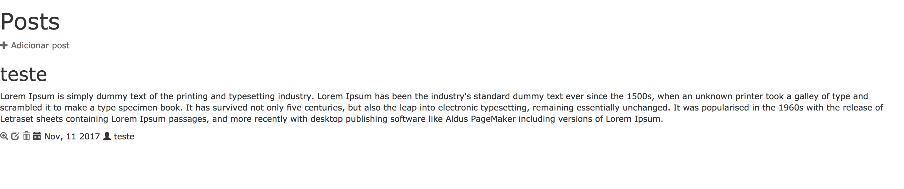

# Agora sim, vamos mudar a nossa página principal  :)

Vamos abrir o arquivo `app/assets/stylesheets/application.css` e adicionar uma margem ao site, inclua o código abaixo no arquivo:

```css
body {
  margin: 10px;
}
```

Vamos mudar o estilo da nossa mensagem, no arquivo `app/views/posts/index.html.erb`, substitua a linha:

```html
<p id="notice"><%= notice %></p>
```

Por essa:

```html
<% if notice %>
  <div class="alert alert-success alert-dismissible" role="alert">
    <button type="button" class="close" data-dismiss="alert" aria-label="Close"><span aria-hidden="true">&times;</span></button>
    <%= notice %>
  </div>
<% end %>
```

Esse é um código pego do [Boostrap](http://getbootstrap.com]) mesmo, você pode encontrar na sessão [Components](http://getbootstrap.com/components/).

Agora, substitua todo o código do arquivo `app/views/posts/index.html.erb`, pelo código abaixo:

```html
<% if notice %>
  <div class="alert alert-success alert-dismissible" role="alert">
    <button type="button" class="close" data-dismiss="alert" aria-label="Close"><span aria-hidden="true">&times;</span></button>
    <%= notice %>
  </div>
<% end %>

<h1>
  Posts
</h1>
<div class="adicionar-post">
  <%= link_to(new_post_path, title: 'Adicionar post') do %>
    <span class="glyphicon glyphicon-plus" aria-hidden="true"></span> Adicionar post
  <% end %>
</div>

<div id="posts">
  <% @posts.each do |post| %>
    <div class="post">
      <h2><%= post.title %></h2>
      <p class="content"><%= post.text %></p>
      <p class="details">
        <% if post.published_date > DateTime.now %>
          <%= link_to(publicar_path(post), title: 'Publicar post', class: 'publicar-post') do %>
            <span class="glyphicon glyphicon-ok" aria-hidden="true"></span>
          <% end %>
        <% end %>
        <%= link_to(post, title: "Visualizar post") do %>
          <span class="glyphicon glyphicon-zoom-in" aria-hidden="true"></span>
        <% end %>
        <%= link_to(edit_post_path(post), title: 'Editar post') do %>
          <span class="glyphicon glyphicon-edit" aria-hidden="true"></span>
        <% end %>
        <%= link_to(post, method: :delete, data: { confirm: 'Você tem certeza?' }, title: 'Excluir post') do %>
          <span class="glyphicon glyphicon-trash" aria-hidden="true"></span>
        <% end %>
        <span class="date">
          <span class="glyphicon glyphicon-calendar" aria-hidden="true"></span> <%= post.published_date.strftime("%b, %m %Y") %>
          <span class="glyphicon glyphicon-user" aria-hidden="true"></span> <%= post.author %>
        </span>
      </p>
    </div>
  <% end %>
</div>
```

O que fizemos no passo anterior foi basicamente remover a tabela que tinha, e mostrar a informação de uma maneira diferente, utilizando `div` (lembra das tags do HTML?).

Nós também alteramos a maneira como os links são mostrados, para usar os ícones do Bootstrap. Mas continua sendo como quando criamos o link da primeira vez.

Se você for no navegador e recarregar a página, deverá estar vendo algo como:



Note que as informações continuam as mesmas, mas mudamos o jeito de mostrar o post :)

Caso queira saber mais sobre `html` e sobre como _alteramos os links com Ruby_, você pode acessar esses links:
- [http://www.w3schools.com/html/](http://www.w3schools.com/html/)

- [http://api.rubyonrails.org/classes/ActionView/Helpers/UrlHelper.html#method-i-link_to](http://api.rubyonrails.org/classes/ActionView/Helpers/UrlHelper.html#method-i-link_to) _(está em inglês, mas você sempre pode usar o Google Tradutor :))_
