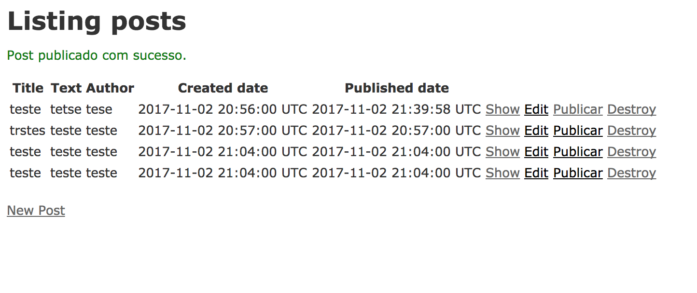
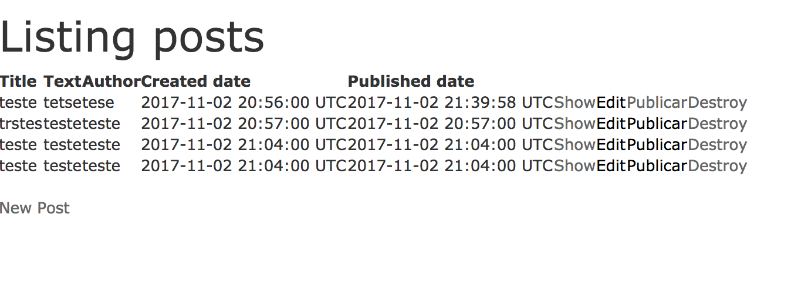

# Trabalhando com layouts

Layouts são `views`, que criam uma estrutura padrão para o nosso site. Esses layouts ficam em `app/layouts`. Por padrão, temos o arquivo `application.html.erb`, que vai estar “em volta” de todas as nossas demais views.
Vamos abrir o arquivo, em `app/views/layouts/application.html.erb`. Ele deve parecer assim:

```html
<!DOCTYPE html>
<html>
  <head>
    <title>Webapp</title>
    <%= stylesheet_link_tag    'application', media: 'all', 'data-turbolinks-track' => true %>
    <%= javascript_include_tag 'application', 'data-turbolinks-track' => true %>
    <%= csrf_meta_tags %>
  </head>
  <body>
    <%= yield %>
  </body>
</html>
```

É uma estrutura HTML padrão, que contém algumas coisinhas diferentes, com código ruby :D

```html
<%= stylesheet_link_tag    'application', media: 'all', 'data-turbolinks-track' => true %>
```
Na linha acima estamos incluindo um arquivo css, que dá o estilo ao nosso site.

```html
<%= javascript_include_tag 'application', 'data-turbolinks-track' => true %>
```
Nessa, estamos incluindo um arquivo javascript.

```html
<%= csrf_meta_tags %>
```
Esta linha inclui uma tag de segurança, que faz com que o Rails saiba que cada página está segura.


```html
<%= yield %>
```
Aqui acontece uma coisa linda do Rails: na linha acima serão incluídos nossas outras views, de acordo com as páginas que acessarmos. Por exemplo, quando acessamos a página inicial do site, vamos ver todos nossos posts, e o html que forma isso é a view em `app/posts/index.html.erb` _(lembra quando adicionamos o link?)_. O conteúdo do arquivo `index.html.erb` que vai ficar em `<% yield %>`

### Vamos mexer no application.html.erb :D

Agora nós vamos adicionar no `application.html.erb`, uma biblioteca css que nos ajuda a criar estilos pro site de maneira muito mais fácil.
Vamos adicionar as linhas em destaque no arquivo, isso vai adicionar o `bootstrap` no nosso site.

```html
<!DOCTYPE html>
<html>
  <head>
    <title>Railsgirls</title>

    <script src="//code.jquery.com/jquery-1.12.0.min.js"></script>
    <script src="//code.jquery.com/jquery-migrate-1.2.1.min.js"></script>
    <!-- Latest compiled and minified CSS -->
    <link rel="stylesheet" href="https://maxcdn.bootstrapcdn.com/bootstrap/3.3.6/css/bootstrap.min.css"  integrity="sha384-1q8mTJOASx8j1Au+a5WDVnPi2lkFfwwEAa8hDDdjZlpLegxhjVME1fgjWPGmkzs7" crossorigin="anonymous">
    <!-- Optional theme -->
    <link rel="stylesheet" href="https://maxcdn.bootstrapcdn.com/bootstrap/3.3.6/css/bootstrap-theme.min.css"  integrity="sha384-fLW2N01lMqjakBkx3l/M9EahuwpSfeNvV63J5ezn3uZzapT0u7EYsXMjQV+0En5r" crossorigin="anonymous">
    <!-- Latest compiled and minified JavaScript -->
    <script src="https://maxcdn.bootstrapcdn.com/bootstrap/3.3.6/js/bootstrap.min.js" integrity="sha384-0mSbJDEHialfmuBBQP6A4Qrprq5OVfW37PRR3j5ELqxss1yVqOtnepnHVP9aJ7xS" crossorigin="anonymous"></script>

    <%= stylesheet_link_tag    'application', media: 'all', 'data-turbolinks-track' => true %>
    <%= javascript_include_tag 'application', 'data-turbolinks-track' => true %>
    <%= csrf_meta_tags %>
  </head>
  <body>
    <%= yield %>
  </body>
</html>
```

## Vamos testar?

No navegador acesse pela mesma url de antes :)

E a diferença, antes:



Depois:



Como vemos, é uma diferença bem sutil, mas o bootstrap tem várias ferramentas que podem nos ajudar a estilizar o site. Você pode ver mais em:
[http://getbootstrap.com/components/](http://getbootstrap.com/components/)
