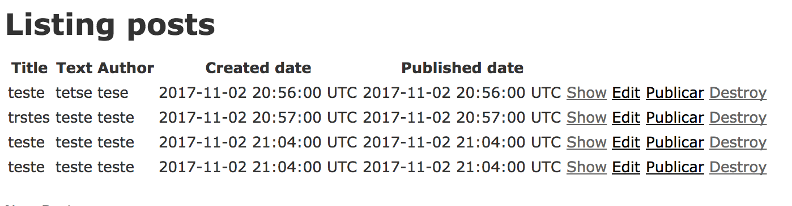

# Publicando posts

Ok, esse vai ser grande! Vamos com calma, qualquer dúvida, chame sua coach <3


Então... vamos criar um método para atualizar a data de publicação do nosso post para a data atual. Bora?

Lá no arquivo `posts_controller.rb`, vamos adicionar as linhas de código abaixo:

```ruby
def publicar
    @post.published_date = DateTime.now

    respond_to do |format|
      if @post.save
        format.html { redirect_to posts_url, notice: 'Post publicado com sucesso.' }
        format.json { render :show, status: :ok, location: @post }
      else
          format.html { redirect_to posts_url, notice: 'Algum erro aconteceu ao tentar publicar o post :(' }
	        format.json { head :no_content }
      end
    end
  end
```

**Obs:** Você pode adicionar essa parte do código logo depois do método destroy. Cuide para adicionar antes da palavra `private`.

Antes de explicarmos o método, temos que adicionar só mais uma coisa, neste mesmo `posts_controller.rb`. Você deve ter uma linha parecida com a abaixo no seu arquivo:

```ruby
before_action :set_post, only: [:show, :edit, :update, :destroy]
```

Substitua ela pela linha abaixo:

```ruby
before_action :set_post, only: [:show, :edit, :update, :destroy, :publicar]
```

Veja que quando adicionamos `:publicar`, estamos dizendo que antes de chamar o método `set_post` (**before_action :set_post**), vamos chamar o método `publicar` (junto com todos aqueles outros que já estavam ali já).


Ta, calma, vamos ver o que é este `set_post`. Ele já está criado, no mesmo arquivo, láá embaixo:

```ruby
private

def set_post
  @post = Post.find(params[:id])
end
```

Ele vai sempre procurar um post com o _identificador(params[:id])_ que mandamos para ele, e colocar o que ele achar (uma lista de Posts) dentro da variável _@post_.

### @ ?????

Essa coisa louca de `@` é uma coisa do Ruby chamada variável de instância... Já conversamos sobre variáveis: **inteiros**, **decimais**, **booleanos** e mais alguns outros, né? Então, falamos que variáveis guardam dados e existem tipos de dados, ok? Ok.

MAS... dependendo do jeito que criamos a variável, muda o tempo de vida dela, ou seja, quando e onde podemos usar elas. Eita. Péra. Buguei.

Vamos com calma. Não precisamos disso para sobreviver, não agora. Leia aqui:
[um pouquinho sobre tipos de dados e tipos de dados](https://unbcjr.gitbooks.io/learning-ruby/content/tipos_de_dados.html) se você se sentir curiosa. Isso pode deixar para deeeeepois, foi só para deixar você curiosa mesmo ;) Mais tarde, na sua jornada no mundo da programação (e depois de estudar sobre orientação à objetos) essas coisas mágicas de `@`, `@@` e `$` no início das variáveis (que podem aparecer aí no meio do código) vão fazer todo o sentido.

Por agora, basta sabermos que é um tipo de variável (assim como `variavel = "Oi meninaaas"` é também).


**Obs:**: Eu sei, você provavelmente olhou aquele `private` (em cima do método set_post) e pensou: _"Ué"_. Junto com aqueles estudos de `@`, você verá a necessidade de esconder alguns métodos. Basta sabermos que todos os métodos e variáveis embaixo do `private` (**privado**) só podem ser usados ali dentro, ninguém de 'fora' de onde eles estiveram pode usar ele.

Legal, né???? :D

É muita coisa!!!! AAAAA Não vou conseguir decorar tudoooo!

Calma, é muito detalhezinho, mas no final tudo se junta e funciona (as vezes não de primeira :P). Tudo fará sentido. E se não fizer, estamos aí do seu lado para responder todas as perguntas. :D Nos chame. Sério.

Ta, continuando...


### Agora vamos olhar de novo o método que criamos:

Então, antes de chamarmos o método **Publicar**, já vimos que o método `set_post` será chamado, que colocará o Post achado na variável _@post_, que podemos ver na primeira linha do método.
Nessa linha, estamos alterando o valor do atributo `published_date` do post, ou seja a data de publicação. Aqui temos algo novo:

```ruby
 @post.published_date = DateTime.now
```

Estamos dizendo que `@post.published_date` vai receber o valor do dia de hoje, que com ruby usamos `DateTime.now`.

Após alterarmos o valor de `@post.published_date`, já iniciamos o código para retornar para o **HTML**. Isso fazemos com a linha `respond_to do |format|`.

Depois, testamos se o post foi salvo com o valor novo, isso com a linha `if @post.save`, caso isso ocorra, direcionamos para a tela principal dos posts: `posts_url` (para o Rails):

```ruby
format.html { redirect_to posts_url, notice: 'Post publicado com sucesso.' }
```

Caso não dê certo, direcionamos para a tela inicial também, com uma mensagem de erro:

```ruby
format.html { redirect_to posts_url, notice: 'Algum erro aconteceu ao tentar publicar o post :(' }
```

O método completo deve ficar assim:

```ruby
def publicar
    @post.published_date = DateTime.now

    respond_to do |format|
      if @post.save
        format.html { redirect_to posts_url, notice: 'Post publicado com sucesso.' }
        format.json { render :show, status: :ok, location: @post }
      else
          format.html { redirect_to posts_url, notice: 'Algum erro aconteceu ao tentar publicar o post :(' }
	        format.json { head :no_content }
      end
    end
  end
```

### Com o método criado, vamos criar o link!

Para excluir e atualizar, devemos criar um link, ou seja, uma rota nova. Você lembra do `routes.rb` (pasta _config/posts_)?

Vamos adiconar a linha abaixo, pode ser bem abaixo de `resources :posts`

```ruby
get 'publicar-post/:id' => 'posts#publicar', as: 'publicar'
```

Essa linha cria uma nova rota, para podermos chegar no método `publicar` que criamos em `posts_controller.rb`.

Estamos dizendo que vamos chamar o controller `PostsController`, na ação `publicar`, enviando um `id`, a identificação do post no banco de dados.

**Obs:** `Controller` é uma coisa muito legal que nós utilizamos para pegar os dados do banco de dados e colocar na tela (onde fica o **HTML**, chamamos aqui de `View`). É outro daqueles negócio meio punk mas que é legal você pesquisar, mas depooooois :P.

**Obs2:** Uau! Banco de dados!! Certamente já ouviu falar esse nome, né? Isso mesmo, estamos utilizando aqui banco de dados, sem nem percebermos. ;) Mas não se assuste, esse monstrinho é muito amigável: banco de dados é a coisa que vai guardar as informações para nós. Seria muitoooo penoso se tivéssemos que guardar muitas informações escrevendo à mão, né? Imagina que é uma planilha Excel que a gente guarda tudo lá e consulta as informações depois. Agora não precisamos mexer nele, nem nada, porque Ruby on Rails já criou tudo para nós :D

TÁ BOM, sem enrolação. :P
Depois de criar a rota, vamos criar o link no **HTML** (justamente para acessar esta rota e usar o método **Publicar**).


###Views

As views são basicamente o **HTML** onde vamos mostrar nossos dados, ou seja, o que o controller mandar para nós, é nas views que iremos mostrar.
Vamos abrir o arquivo `app/views/posts/index.html.erb`:

```html
<h1>Listing posts</h1>

<table>
  <thead>
    <tr>
      <th>Title</th>
      <th>Text</th>
      <th>Author</th>
      <th>Created date</th>
      <th>Published date</th>
      <th colspan="3"></th>
    </tr>
  </thead>

  <tbody>
    <% @posts.each do |post| %>
      <tr>
        <td><%= post.title %></td>
        <td><%= post.text %></td>
        <td><%= post.author %></td>
        <td><%= post.created_date %></td>
        <td><%= post.published_date %></td>
        <td><%= link_to 'Show', post %></td>
        <td><%= link_to 'Edit', edit_post_path(post) %></td>
        <td><%= link_to 'Destroy', post, method: :delete, data: { confirm: 'Are you sure?' } %></td>
      </tr>
    <% end %>
  </tbody>
</table>

<br>

<%= link_to 'New Post', new_post_path %>
```

#### Mas antes de criar o link… vamos entender umas coisinhas

Note que o arquivo não é totalmente **HTML**, ele termina com extensão `.erb`, que serve para que ele entenda código ruby. Mas ele não entende SEMPRE o código ruby, ele entende só quando têm as seguintes tags:

* `<%` \- que mostra que código ruby está começando
* `%>` \- que mostra que código ruby está terminando
* `<%= … %>` \- contém um código ruby que vai só mostrar algo, não executar

Temos algo no `index.html.erb`, são os laços de repetição em ruby, podemos ver ele sendo iniciado no seguinte linha:

```html
<% @posts.each do |post| %>
  <tr>
    <td><%= post.title %></td>
    <td><%= post.text %></td>
    <td><%= post.author %></td>
    <td><%= post.created_date %></td>
    <td><%= post.published_date %></td>
    <td><%= link_to 'Show', post %></td>
    <td><%= link_to 'Edit', edit_post_path(post) %></td>
    <td><%= link_to 'Destroy', post, method: :delete, data: { confirm: 'Are you sure?' } %></td>
  </tr>
<% end %>
```

Note que nessa linha usamos o **<%** para iniciar o laço de repetição. Mas então, o que isso faz?

**@posts**, que criamos agora pouco, quando criamos a rota, é  uma lista. Então estamos iterando (passando por todos os itens da lista, um por um) na lista. Cada item nós damos o nome de `post`. Então, dentro da tag `<tr>`, estamos mostrando os dados desse post e criando os links para atualizar, excluir e mostrar ele. Finalizando o laço de repetição com a linha **<% end %>**

Ufa!

#### Agora sim, vamos criar o link!

Agora que já vimos como usar código ruby dentro do html e como funciona o laço de repetição, vamos criar o link para atualizar o estado do nosso post! Voltando ao laço de repetição, vamos adicionar uma linha nova, para o Publicar.

No nosso arquivo `index.html.rb`, podemos adicionar a linha:
```html
<td><%= link_to 'Publicar', publicar_path(post) %></td>
```

Vai ficar assim:

```html
<% @posts.each do |post| %>
  <tr>
    <td><%= post.title %></td>
    <td><%= post.text %></td>
    <td><%= post.author %></td>
    <td><%= post.created_date %></td>
    <td><%= post.published_date %></td>
    <td><%= link_to 'Show', post %></td>
    <td><%= link_to 'Edit', edit_post_path(post) %></td>
    <td><%= link_to 'Publicar', publicar_path(post) %></td>
    <td><%= link_to 'Destroy', post, method: :delete, data: { confirm: 'Are you sure?' } %></td>
  </tr>
<% end %>
```

Essa linha criará o link (através da rota) para o método que criamos no controller. O controller vai publicar o post e retornará para a mesma tela, com o post atualizado :D YEY!

## Último passo (finalmente)

Precisamos adicionar somente mais uma linha para mostrar corretamente as nossas mensagens de sucesso ou erro depois que publicamos um post! Para isso no início do arquivo `index.html.erb`, adicione a linha:

```html
<p id="notice"><%= notice %></p>
```

Nessa linha temos um parágrafo em **HTML**, que irá mostrar a mensagem (variável notice) que vem da controller, lembra?

Agora, seu `index.html.erb` deve estar assim:

```html
<h1>Listing posts</h1>

<p id="notice"><%= notice %></p>

<table>
  <thead>
    <tr>
      <th>Title</th>
      <th>Text</th>
      <th>Author</th>
      <th>Created date</th>
      <th>Published date</th>
      <th colspan="4"></th>
    </tr>
  </thead>

  <tbody>
    <% @posts.each do |post| %>
      <tr>
        <td><%= post.title %></td>
        <td><%= post.text %></td>
        <td><%= post.author %></td>
        <td><%= post.created_date %></td>
        <td><%= post.published_date %></td>
        <td><%= link_to 'Show', post %></td>
        <td><%= link_to 'Edit', edit_post_path(post) %></td>
        <td><%= link_to 'Publicar', publicar_path(post) %></td>
        <td><%= link_to 'Destroy', post, method: :delete, data: { confirm: 'Are you sure?' } %></td>
      </tr>
    <% end %>
  </tbody>
</table>

<br>

<%= link_to 'New Post', new_post_path %>
```

### Vamos testar? :D
Abra o blog no navegador com a mesma url já utilizada :)



Uhuul, o link novo está aparecendo! E o que acontece se clicarmos nele?


Uhuul, o post é publicado! E a mensagem aparece!
